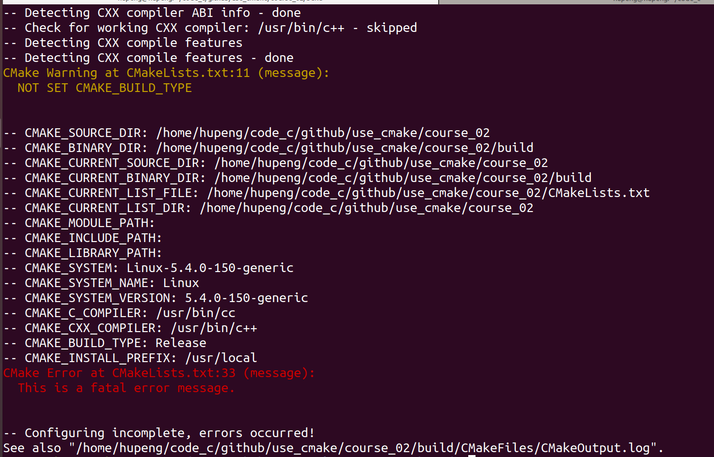

# 第二节：CMake变量与打印变量信息

本节项目代码在，https://github.com/HuPengsheet/use_cmake/tree/master/course_02

项目结构：

.
├── CMakeLists.txt
└── src
    └── main.cpp

## CMake中设置变量

​	还是和上节的代码结构基本一样，只是把源代码放在了src目录下。这次我们略微修改一下CMakeLists.txt

```cmake
#CMakeLists.txt
cmake_minimum_required(VERSION 3.10)
project(course_01 VERSION 0.0.1)

set(CMAKE_CXX_STANDARD 11)  # 将 C++ 标准设置为 C++ 11
set(CMAKE_CXX_STANDARD_REQUIRED ON)  # C++ 11 是强制要求，不会衰退至低版本
set(CMAKE_CXX_EXTENSIONS OFF)  # 禁止使用编译器特有扩展

set(SRC ${CMAKE_CURRENT_SOURCE_DIR}/src/main.cpp)
add_executable(run ${SRC})
```

​	在cmake中我们可以使用set关键词设置变量值，并使用`${VAR}`来引用这一个变量。我们将原本直接写main.cpp，变成把源代码的路径写入到一个变量中，通过引用变量来构建add_executable。

`${CMAKE_CURRENT_SOURCE_DIR}`是cmake的内置变量，我们可以直接引用这个变量来获取当前的工作目录

## CMake常用内置变量

列举一些常见的CMake内置变量，需要注意的是内置变量都是CMAKE开头

1. CMAKE_SOURCE_DIR: CMakeLists.txt所在的顶级源代码目录的路径。
2. CMAKE_BINARY_DIR: 构建目录的路径，即执行cmake命令时生成的Makefile或其他构建系统文件所在的目录。
3. CMAKE_CURRENT_SOURCE_DIR: 当前处理的CMakeLists.txt所在的目录的路径。
4. CMAKE_CURRENT_BINARY_DIR: 当前处理的CMakeLists.txt生成的目标文件所在的目录的路径。
5. CMAKE_CURRENT_LIST_FILE: 当前正在处理的CMakeLists.txt的完整路径和文件名。
6. CMAKE_CURRENT_LIST_DIR: 当前正在处理的CMakeLists.txt所在的目录的路径。
7. CMAKE_MODULE_PATH: 用于指定额外的CMake模块的路径。
8. CMAKE_INCLUDE_PATH: 用于指定额外的包含文件的路径。
9. CMAKE_LIBRARY_PATH: 用于指定额外的库文件的路径。
10. CMAKE_SYSTEM: 当前操作系统的名称。
11. CMAKE_SYSTEM_NAME: 当前操作系统的名称，与CMAKE_SYSTEM相同。
12. CMAKE_SYSTEM_VERSION: 当前操作系统的版本号。
13. CMAKE_C_COMPILER: C编译器的路径。
14. CMAKE_CXX_COMPILER: C++编译器的路径。
15. CMAKE_BUILD_TYPE: 构建类型，如Debug、Release等。
16. CMAKE_INSTALL_PREFIX: 安装目录的路径。

​	另外有一些内置变量是没有值的，以`CMAKE_BUILD_TYPE`为例。`CMAKE_BUILD_TYPE`是控制构建类型的，有这些选项值，

1. Debug：用于开发和调试的构建类型。此模式通常包含调试符号信息，并启用额外的调试功能，例如断言检查和运行时错误检查。此模式下通常关闭优化，以便更容易进行调试。

2. Release：用于发布最终产品的构建类型。此模式通常启用各种优化选项，以提高代码的执行速度和减小最终产品的大小。同时，此模式通常不包含调试符号信息，以减小可执行文件的大小。

3. RelWithDebInfo：结合了Release和Debug的特点。此模式启用了优化选项，同时保留了调试符号信息。这样可以在需要进行调试时获得更多的信息。

4. MinSizeRel：用于最小化生成的可执行文件大小的构建类型。此模式启用了各种优化选项，以减小最终产品的大小。通常不包含调试符号信息。

   ​	在我们默认什么都没做的的情况下，CMAKE_BUILD_TYPE为空，CMake默认编译为Debug模式，但是通常我们发布在github上时我们是Release版本，所以我们经常会在别人的CMakeLists.txt文件中看见如下代码片段

   ```cmake
   if(NOT CMAKE_BUILD_TYPE)
   	set(CMAKE_BUILD_TYPE "Release")
   endif()
   ```

   ​	即如果用户没有指定这个变量，则把CMAKE_BUILD_TYPE设置为Release，编译的时候就会为Release版本，而不是Debug版本。

   ```shell
   cmake .. -DCMAKE_BUILD_TYPE=MinSizeRel
   ```

   ​	同时用户也可以在执行cmake命令的时候，加-DCMAKE_BUILD_TYPE，来手动指定构建的类型。	

## 	使用Message打印信息

message函数就相当于printf函数，用来在控制台打印出相关信息,message一共有三种模式

```cmake
message("Hello, World!")  # 默认以STATUS模式输出消息
message(STATUS "This is a status message.")
message(WARNING "This is a warning message.")
message(FATAL_ERROR "This is a fatal error message.")
```

我们用下面的CMakeLists.txt来看看message的效果

```cmake
#CMakeLists.txt

cmake_minimum_required(VERSION 3.10)
project(course_01 VERSION 0.0.1)

set(CMAKE_CXX_STANDARD 11)  # 将 C++ 标准设置为 C++ 11
set(CMAKE_CXX_STANDARD_REQUIRED ON)  # C++ 11 是强制要求，不会衰退至低版本
set(CMAKE_CXX_EXTENSIONS OFF)  # 禁止使用编译器特有扩展

if(NOT CMAKE_BUILD_TYPE)
	message(WARNING "NOT SET CMAKE_BUILD_TYPE")
    set(CMAKE_BUILD_TYPE "Release")
endif()

message(STATUS "CMAKE_SOURCE_DIR: ${CMAKE_SOURCE_DIR}")
message(STATUS "CMAKE_BINARY_DIR: ${CMAKE_BINARY_DIR}")
message(STATUS "CMAKE_CURRENT_SOURCE_DIR: ${CMAKE_CURRENT_SOURCE_DIR}")
message(STATUS "CMAKE_CURRENT_BINARY_DIR: ${CMAKE_CURRENT_BINARY_DIR}")
message(STATUS "CMAKE_CURRENT_LIST_FILE: ${CMAKE_CURRENT_LIST_FILE}")
message(STATUS "CMAKE_CURRENT_LIST_DIR: ${CMAKE_CURRENT_LIST_DIR}")
message(STATUS "CMAKE_MODULE_PATH: ${CMAKE_MODULE_PATH}")
message(STATUS "CMAKE_INCLUDE_PATH: ${CMAKE_INCLUDE_PATH}")
message(STATUS "CMAKE_LIBRARY_PATH: ${CMAKE_LIBRARY_PATH}")
message(STATUS "CMAKE_SYSTEM: ${CMAKE_SYSTEM}")
message(STATUS "CMAKE_SYSTEM_NAME: ${CMAKE_SYSTEM_NAME}")
message(STATUS "CMAKE_SYSTEM_VERSION: ${CMAKE_SYSTEM_VERSION}")
message(STATUS "CMAKE_C_COMPILER: ${CMAKE_C_COMPILER}")
message(STATUS "CMAKE_CXX_COMPILER: ${CMAKE_CXX_COMPILER}")
message(STATUS "CMAKE_BUILD_TYPE: ${CMAKE_BUILD_TYPE}")
message(STATUS "CMAKE_INSTALL_PREFIX: ${CMAKE_INSTALL_PREFIX}")


message(FATAL_ERROR "This is a fatal error message.")

set(SRC ${CMAKE_CURRENT_SOURCE_DIR}/src/main.cpp)
add_executable(run ${SRC})

```

执行`cmake  ..`命令

下面是运行结果



​	对于STATUS这是会打印出对应的值，WARNING则是会打印出一个警告，但不会影响CMake的运行，FATAL_ERROR则是会终止CMake的运行。把`message(FATAL_ERROR "This is a fatal error message.")`这行注释掉，代码就可正常运行。