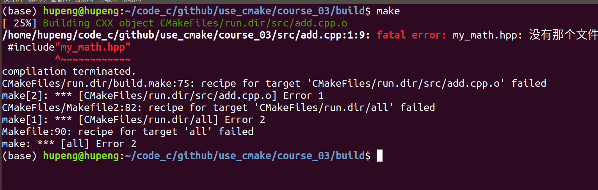

# 第三节：多个源文件和头文件

本节项目代码在：https://github.com/HuPengsheet/use_cmake/tree/master/course_03

​	在实际的项目中，我们往往有许多的头文件和源文件，所有的头文件会放在一个目录下，所有的源文件会放在一个目录下。如下所示是示例代码的结构
```
.
├── CMakeLists.txt
├── include
│   └── my_math.hpp
└── src
    ├── add.cpp
    ├── main.cpp
    └── sub.cpp
```
​	以下是每个文件里的代码

```c++
//my_math.hpp

#ifndef MY_MATH_HPP
#define MY_MATH_HPP

int add(int a,int b);
int sub(int a,int b);

#endif

```

​	在my_math.hpp头文件里申明了两个函数

```c++
//add.cpp

#include"my_math.hpp"

int  add(int a,int b){
    return a+b;
}


//sub.cpp
#include"my_math.hpp"

int sub(int a,int b){
    return a-b;
}
```

在add.cpp和sub.cpp里分别实现了头文件里申明的两个函数，加法函数和减法函数。

我们在main函数调调用这两个函数

```c++
#include<iostream>
#include"my_math.hpp"
using namespace std;
int main(){
    cout<<"3+2="<<add(2,3)<<endl;
    cout<<"3-2="<<sub(3,2)<<endl;

}
```

接下来是CMakeLists.txt

```cmake
cmake_minimum_required(VERSION 3.10)
project(course_03)

set(CMAKE_CXX_STANDARD 11)  # 将 C++ 标准设置为 C++ 11
set(CMAKE_CXX_STANDARD_REQUIRED ON)  # C++ 11 是强制要求，不会衰退至低版本
set(CMAKE_CXX_EXTENSIONS OFF)  # 禁止使用编译器特有扩展

if(NOT CMAKE_BUILD_TYPE)
	message(WARNING "NOT SET CMAKE_BUILD_TYPE")
    set(CMAKE_BUILD_TYPE "Release")
endif()

aux_source_directory(src SRC)
#message(STATUS ${SRC})
set(INCLUDE "include")

add_executable(run ${SRC})
target_include_directories(run PRIVATE ${INCLUDE})
```

## 使用aux_source_directory获取所有源文件

​	相较于之前编写的CMakeLists.txt，在这里我们通过aux_source_directory命令获取文件夹中的所有源文件名称	

​	`aux_source_directory(<dir> <variable>)`


这个函数的第一个参数是目录名称，第二个是变量的名字，用来存放搜索到的文件名。

```cmake
aux_source_directory(src SRC)
```

​	也就是，将src下面所有cpp源文件的名字，记录到变量SRC中，然后再通过`${SRC}`引用变量，避免我们一个个手动写上所有的源文件名称。同时我们也可以使用`message(STATUS ${SRC})`，将变量的值打印出来，下面是打印结果。

```shell
-- src/add.cpp src/main.cpp src/sub.cpp
```

​	可以看到`SRC`变量下记录的是源文件的相对路径

## 为目标添加文件包含路径

CMakeLists.txt中有这么几行代码

```cmake
set(INCLUDE "include")
add_executable(run ${SRC})
target_include_directories(run PRIVATE ${INCLUDE})
```

​	我们在前面提到过，`add_executable(run ${SRC})`中的run是一个cmake目标，target_include_directories是给run目标添加**包含目录**这个属性。在这次的代码结构中，我们有一个头文件，my_math.hpp在include目录下，如果我们不指明run目标的包含目录的话我们在执行make命令的时候就会报如下错误：



​	也就是目标，找不到头文件放哪了。**另外PRIVATE是指明作用域的，我们会在下一节做详细介绍。**

​	关于cmake中的目标和目标的属性，我们会在下一节详细介绍。
