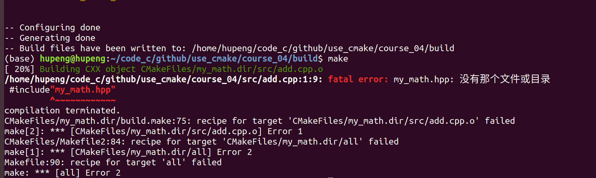

# 第四节：CMake目标与目标属性

本节代码链接：https://github.com/HuPengsheet/use_cmake/tree/master/course_04		

在前面的章节里，我们曾多次提及CMake中目标的概念，在本节中，我们将系统的介绍相关概念。

​	在CMake中主要有三种生成目标的办法：

```cmake
add_executable(run main.cpp)   #生成可执行文件目标run
add_library(math SHARED add.cpp sub.cpp)   #生成共享库目标math
add_library(math STATIC add.cpp sub.cpp)   #生成静态库目标math
```

​	使用`add_executable`生成可执行目标，`add_library`可以用来生成共享库与静态库目标(SHARED表示共享库，STATIC表示静态库)。那CMake中的目标究竟是什么意思呢？其实这里目标的概念，和C++面向对象的概念是类似的。run和math就相当于是一个对象，对象有各种各样的属性值，我们利用一些函数就可以对这些属性赋值。在第三节的代码中，我们写过这么一行代码

```cmake
target_include_directories(run PRIVATE ${INCLUDE})
```

​	`target_include_directories()`就相当于给run这个目标的`INCLUDE_DIRECTORIES`进行赋值，指明了run目标的包含路径，这样我们在生成run这个可执行文件的过程中，它就知道在哪些路径下去找头文件。

​	看到这里可能会有人想，既然有指定头文件路径的这个属性，那肯定也有目标的源文件（cpp）存放地址的这个属性。不错`SOURCES`这个属性就是干这个事情的，于是我们有这种写CMake的方法

```cmake
add_executable(run) 
target_sources(run PRIVATE ${SRC})
target_include_directories(run PRIVATE ${INCLUDE}
```

​	分别使用`target_sources`和`target_include_directories`来用来制定目标的源文件和头文件在哪。PRIVATE表示作用域，我们会在本节的后面讲解。

## 设置目标属性值

​	要想设置目标的属性值，我们肯定得知道目标一共有哪些内置的属性值，我们可以在CMake官方的手册上找到

​		https://cmake.org/cmake/help/latest/manual/cmake-properties.7.html

​	知道有哪些属性和这些属性对应的作用后，一般有两种方式来设置

​	第一种也是比较常用的就是：

```cmake
#设置包含路径
target_include_directories(target_name PUBLIC include_dir)
#设置编译时预定义的宏
target_compile_definitions(target_name PUBLIC definition)
#设置编译选项
target_compile_options(target_name PUBLIC option)
#设置链接的库
target_link_libraries(target_name library_name)
#设置源文件
target_sources(target_name PUBLIC source_file)
#设置编译C++特性
target_compile_features(target_name PUBLIC feature)
```

​	 设置目标的属性还有一个通用命令

```cmake
set_target_properties(target1 target2 ...
                      PROPERTIES prop1 value1
                      prop2 value2 ...)
```

​	也就是使用`set_target_properties`指明要给哪个目标的哪个属性赋值。

​	所以我们可以使用一行`set_target_properties`获得上面等价的代码（**不会完全等价，主要是因为（PUBLIC）作用域的原因，在本节最后面会讲**）：

```cmake
set_target_properties(target_name 
                      PROPERTIES 
                      INCLUDE_DIRECTORIES include_dir
                      COMPILE_DEFINITIONS definition 
                      COMPILE_OPTIONS option
                      LINK_LIBRARIES library_name
                      SOURCES source_file
                      COMPILE_FEATURES feature)
```

## 	获取目标的属性值

```cmake
get_target_property(<VAR> target property)
```

使用`get_target_property`可以获得目标某个属性的值，并存放到变量中供我们使用。使用下面代码可以把，我们上面赋值的属性取出来：

```cmake
get_target_property(include_dir target_name INCLUDE_DIRECTORIES)
get_target_property(definition target_name COMPILE_DEFINITIONS)
get_target_property(option target_name COMPILE_OPTIONS)
get_target_property(library_name target_name LINK_LIBRARIES)
get_target_property(source_file target_name SOURCES)
get_target_property(feature target_name COMPILE_FEATURES)
```


## INTERFACE、PUBLIC和PRIVATE

​	前面曾多次提到过在使用诸如`target_include_directories`命令的时候，有一个作用域的参数，该参数只能在INTERFACE、PUBLIC和PRIVATE选一个，下面是对应的三种情况。

```cmake
target_include_directories(target_name PUBLIC include_dir)
target_include_directories(target_name INTERFACE include_dir)
target_include_directories(target_name PRIVATE include_dir)
```

​	我们来通过一个简单的例子，解释一下他们的区别。假设我们要生成一个可执行程序run和一个静态库my_math，run需要链接到my_math库，那么这个CMakelists.txt应该怎么编写？源码基本和上节的代码一样，只是结构发生了一些变化。

代码链接：https://github.com/HuPengsheet/use_cmake/tree/master/course_04	

代码结构如下：

.
├── CMakeLists.txt
├── include
│   └── my_math.hpp
├── src
│   ├── add.cpp
│   └── sub.cpp
└── test
    └── main.cpp

```c++
/***************************************************/
//my_math.hpp

#ifndef MY_MATH_HPP
#define MY_MATH_HPP

int add(int a,int b);
int sub(int a,int b);

#endif
/***************************************************/


/***************************************************/
//add.cpp
#include"my_math.hpp"

int  add(int a,int b){
    return a+b;
}


//sub.cpp
#include"my_math.hpp"

int sub(int a,int b){
    return a-b;
}
/***************************************************/


//main.cpp
#include<iostream>
#include"my_math.hpp"
using namespace std;
int main(){
    cout<<"3+2="<<add(2,3)<<endl;
    cout<<"3-2="<<sub(3,2)<<endl;

}
```

​	 重新编写的CMakeLists.txt内容如下：

```cmake
#CMakeLists.txt

cmake_minimum_required(VERSION 3.10)
project(course_04)

set(CMAKE_CXX_STANDARD 11)  # 将 C++ 标准设置为 C++ 11
set(CMAKE_CXX_STANDARD_REQUIRED ON)  # C++ 11 是强制要求，不会衰退至低版本
set(CMAKE_CXX_EXTENSIONS OFF)  # 禁止使用编译器特有扩展

if(NOT CMAKE_BUILD_TYPE)
	message(WARNING "NOT SET CMAKE_BUILD_TYPE")
    set(CMAKE_BUILD_TYPE "Release")
endif()

aux_source_directory(src SRC)   #获取src目标下的所有源文件
set(INCLUDE "include")     #设置头文件路径

add_library(my_math)
target_sources(my_math PRIVATE ${SRC})     #设置源文件

target_include_directories(my_math PUBLIC ${INCLUDE})  #设置头文件
##target_include_directories(my_math INTERFACE ${INCLUDE})  
##target_include_directories(my_math PRIVATE ${INCLUDE}) 


add_executable(run test/main.cpp)
target_link_libraries(run my_math)

```

​	我们尝试将`target_include_directorie`s的作用域分别设置为`INTERFACE`、`PUBLIC`和`PRIVATE`这三种，观察代码编译情况。

​	第一种情况，设置为PUBLIC，代码正常运行。

​	第二种情况，设置为PRIVATE，报错，提示**main.cpp**找不到头文件。 


​    第三种情况，设置为INTERFACE，报错，提示**add.cpp**找不到头文件。



​	不难发现，设置为`PRIVATE`，其实就是设置my_math这个库在编译的时候自己的头文件在哪里找，也就是它的源文件add.cpp和sub.cpp的头文件应该在哪里找。而`INTERFACE`，是别的目标在链接这个库的时候，如何去找这个库提供的头文件。其实也就是一个对内使用一个是对外使用。设置为`PUBLIC`就是把对内和对外的头文件的包含路径都设置成一样的。

​	所以当我们设置为`PUBLIC`时，在编译过程中，会先编译生成静态库，add.cpp和sub.cpp源文件知道头文件放在include下面，静态库生成成功。编译main.cpp的时候，虽然我们没有设置run目标的头文件路径，但是我们通过`target_link_libraries(run my_math)`在链接my_math目标的时候，路径是设置了`PUBLIC`，所以my_math库指明了自己对外的头文件也是放在了include下面，main.cpp也就会在include下去找，最后编译成功生成run目标。相对应的`target_compile_definitions`等命令也是类似的

​	这里需要说明的一点就是，大部分情况下对内的头文件和对外的头文件是不一样的。这是因为，在开发的过程中，我们会有很多内部使用的函数是不会把其接口暴露出来的，我们只会把一部分的接口放在对外的头文件里供别人使用，所以对面的头文件里的函数一般是更少的。所以我们有的时候会看到有这种写法,就是在变量名字面前加一个宏定义，如果有这个宏说明要导出这个类或者函数，对外使用，不导出则说明在库里面对内使用。

```c++
class EXPORT Mat{
    
}

class  Vestor{
    
}
```

​	回到刚刚作用域的问题，从本质上来看`target_include_directories`总归是为目标的属性赋值。如果是设置为`PRIVATE`，那么它实际是给 `INCLUDE_DIRECTORIES`这个属性赋值。如果是设置为`INTERFACE`，那么它实际是给`INTERFACE_INCLUDE_DIRECTORIES`这个属性赋值。如果设置为`PUBLIC`，那么同时给`INCLUDE_DIRECTORIES`和`INTERFACE_INCLUDE_DIRECTORIES`赋值。相关的属性解释在https://cmake.org/cmake/help/latest/manual/cmake-properties.7.html

​	最后总结一下，目标A本身编译生成时，找的是自己里面的`INCLUDE_DIRECTORIES`这个路径。目标B生成需要链接目标A，那么它既找自己里面的`INCLUDE_DIRECTORIES`路径，也找目标A的`INTERFACE_INCLUDE_DIRECTORIES`路径。